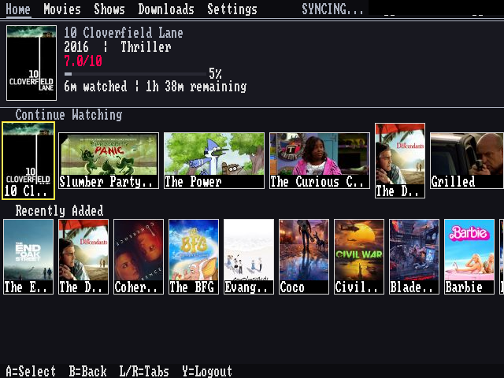
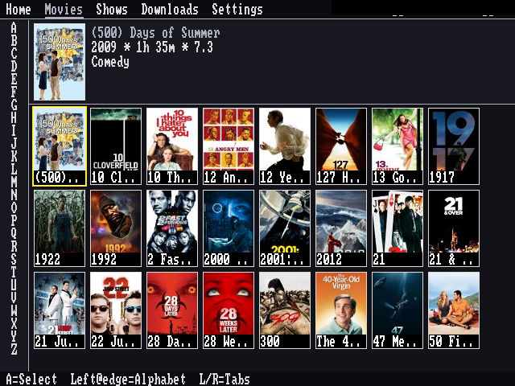
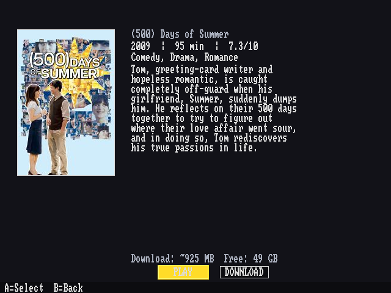
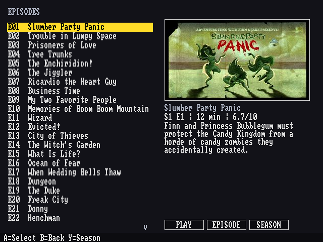
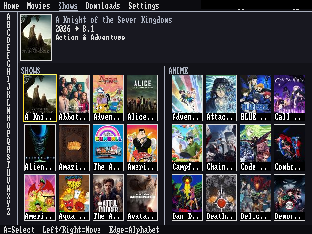
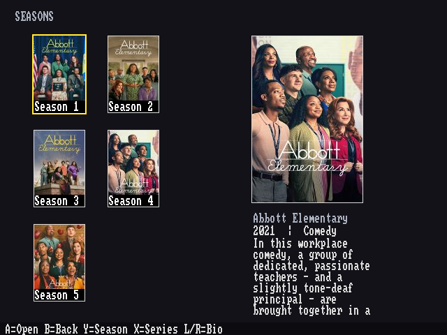
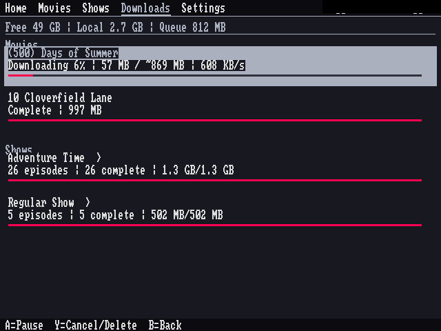

# MiyooFin - A native Jellyfin client for the Miyoo Mini Plus (OnionOS)

Native Jellyfin media browser for the Miyoo Mini Plus running OnionOS.
Built with C++17, SDL2, libcurl, and json-c.

> **Unofficial third-party project:** MiyooFin is an independent client and is
> not affiliated with, endorsed by, or an official client of Jellyfin, Inc.,
> the Miyoo hardware manufacturer, or the OnionOS project. “Jellyfin”, “Miyoo”,
> and “OnionOS” are used only to identify software compatibility and the target
> platform. MiyooFin uses its own name and logo.

## Features

- **Library browsing** — Movies and Shows (including separate library views such
  as Anime), drill-down from series → seasons → episodes, and an alphabet rail
  for jumping through large libraries.
- **Home rails** — Continue Watching and Recently Added, with resume positions
  from your server.
- **Downloads** — server-side transcoded HLS (H.264/AAC) for a movie, episode,
  season or whole series. Segmented and resumable, recoverable after a crash or
  reboot, with pause / resume / retry / delete.
- **Playback** — local-first: plays the downloaded copy when there is one, and
  otherwise streams. Progress is reported back to Jellyfin, so Continue Watching
  stays in sync.
- **Offline mode** — switch it on and the UI lists only what you have downloaded
  (the Home tab disappears); browsing and playback keep working with no network.
- **Over-the-air updates** — check for and install new versions from the Settings
  screen (0.2.0 and later), with SHA-256 verification and rollback on failure.
- **Small** — the client is about 1.7 MB; the release download is ~3.4 MB.

## Screenshots

| Home | Movies |
|---|---|
|  |  |

| Movie preview | Episode list |
|---|---|
|  |  |

| Shows | Seasons |
|---|---|
|  |  |

| Downloads | |
|---|---|
|  | |

## Known limitations

Stated up front rather than discovered later:

- **No text search** — you can only move through the library with the alphabet
  rail on the left of the Movies and Shows tabs.
- **No subtitles** — external subtitle tracks are not fetched or displayed.
- **Movies and TV only** — no music, albums, or audio playback.
- **No quality picker** — downloads use one fixed profile tuned for the device's
  640x480 screen.
- **No mark-as-played/unplayed**, favourites, playlists or collections from the
  device.

## Installation

**Requires:** Miyoo Mini Plus running [OnionOS](https://github.com/OnionUI/Onion).

1. Download the latest `MiyooFin.zip` release.
2. Extract it and copy the `MiyooFin/` folder to the SD card at:
   ```
   SDCARD/App/MiyooFin/
   ```
3. On your Miyoo, launch **Apps → MiyooFin** from the OnionOS menu.

No manual shared-library setup is required for a normal installation;
the prebuilt package is designed to run within the OnionOS environment.

> **Updating from a beta:** `v0.1.0-beta.x` builds have no updater. Download the
> current `MiyooFin.zip` and copy the folder over your existing installation —
> settings and downloads are preserved. From 0.2.0 onward, **Settings → UPDATES**
> installs new versions in place.

## Status

Active development — browsing, playback, downloads, offline mode and OTA updates
are functional and verified on hardware. See
[Known limitations](#known-limitations) for what is not there yet.

## Building

### Prerequisites

- Docker (required for cross-compilation)
- GNU Make
- A Miyoo Mini Plus running OnionOS and reachable over SSH
  (needed once for the first-time library import step below)

### First-time setup

Enable SSH on the Miyoo, then fetch six external build-time libraries:

```shell
make import-miyoo-libs
```

The script prompts for the Miyoo IP address or hostname and SSH username.
OnionOS uses `onion` by default when SSH authentication is enabled; use
`root` when SSH authentication is disabled.

For non-interactive use, provide a full SSH target:

```shell
MIYOO_HOST=onion@192.168.1.50 make import-miyoo-libs
```

### Host (development)

```shell
make
```

Runs on the build machine. Produces `output/build/miyoofin`.

### OnionOS (cross-compilation via Docker)

```shell
make onionos
```

### OnionOS package

```shell
make package
```

Stages the ready-to-copy OnionOS App folder under `output/package/`.

For a public binary release, use `sh tools/build-release.sh` instead. That
wrapper adds the project license and third-party notices before creating the
redistributable ZIP. See [RELEASING.md](RELEASING.md).

### Quality loop

The normal host-side quality loop is:

```shell
make format-check
make -j2
make test -j2
make refactor-check
git diff --check
```

Production C/C++ and first-party C/C++ tools are checked with the repository's
`.clang-format` configuration. The host and ARM Makefiles compile first-party
C++ with `-Wall -Wextra -Wpedantic`; vendored `stb_image` is the only narrow
translation-unit warning exception. CI runs the authoritative clang-format
check. An optional host-only `make clang-tidy` target is documented in
[docs/code-quality.md](docs/code-quality.md).

### Verify ARM binary

```shell
make verify-arm
```

### Clean

```shell
make clean
```

For build-system details, see [docs/toolchain.md](docs/toolchain.md).

## Hardware

- **Device:** Miyoo Mini Plus
- **SoC:** SigmaStar SSD202D
- **CPU:** Dual-core ARM Cortex-A7 @ ~1.2 GHz
- **RAM:** 128 MB
- **Display:** 640x480
- **ABI:** ARMv7 hard-float (`arm-linux-gnueabihf`)
- **OS:** OnionOS (UI overhaul within the Miyoo firmware environment)

## License

GPL-3.0-only — see [LICENSE](LICENSE) for the full text.

Bundled-component licenses, notices, and source-availability information are
recorded in [THIRD_PARTY_NOTICES.md](THIRD_PARTY_NOTICES.md).
