# MiyooFin - A native Jellyfin client for the Miyoo Mini Plus (OnionOS)

Native Jellyfin media browser for the Miyoo Mini Plus running OnionOS.
Built with C++17, SDL2, libcurl, and json-c.

> **Unofficial third-party project:** MiyooFin is an independent client and is
> not affiliated with, endorsed by, or an official client of Jellyfin, Inc.,
> the Miyoo hardware manufacturer, or the OnionOS project. “Jellyfin”, “Miyoo”,
> and “OnionOS” are used only to identify software compatibility and the target
> platform. MiyooFin uses its own name and logo.

## Features

- **Library browsing** — Movies and Shows (including separate library views such
  as Anime), drill-down from series → seasons → episodes, and an alphabet rail
  for jumping through large libraries.
- **Home rails** — Continue Watching and Recently Added, with resume positions
  from your server.
- **Downloads** — server-side transcoded HLS (H.264/AAC) for a movie, episode,
  season or whole series. Segmented and resumable, recoverable after a crash or
  reboot, with pause / resume / retry / delete.
- **Playback** — local-first: plays the downloaded copy when there is one, and
  otherwise streams. Progress is reported back to Jellyfin, so Continue Watching
  stays in sync.
- **Offline mode** — switch it on and the UI lists only what you have downloaded
  (the Home tab disappears); browsing and playback keep working with no network.
- **MiyooFin Music** — a second mode (Settings → MiyooFin Music) with its own
  purple look: browse artists, albums, songs and playlists, a play queue with
  shuffle/repeat, gapless playback in a separate audio engine while you keep
  browsing, album-art Now Playing, offline album/playlist downloads, and plays
  reported back to Jellyfin. See [docs/music.md](docs/music.md).
- **Subtitles and languages** — text and DVD/PGS subtitle tracks, a track menu in
  the player (SELECT), and default audio / subtitle languages in Settings.
- **Skip intro / credits** — the player offers a skip button when your Jellyfin
  server (10.10+) has marked the segment.
- **Mark watched / unwatched** — movies, episodes, seasons and series (with a
  confirmation for seasons and series); changes made offline sync later.
- **Playlists** — in Music: add to a playlist, create, remove from and delete
  playlists, or save the play queue as a playlist.
- **Lyrics** — Up on Now Playing shows the song's lyrics, following along when they are time-synced.
- **Screen-off listening** — START + SELECT together darken the screen and lock
  the buttons while music plays; press them together again to unlock.
- **Signing in** — a username and password, or **Quick Connect** (approve the
  Miyoo from another Jellyfin client). Two server addresses (Home network and
  Internet) with a **Test connection** row in Settings.
- **Over-the-air updates** — check for and install new versions from the Settings
  screen (0.2.0 and later), with SHA-256 verification and rollback on failure.
- **Small** — the client is about 1.7 MB; the release download is ~3.4 MB.

## Screenshots

All screenshots are rendered from made-up libraries (the UI test server and a fake music
library), so they show no real server, account, playlists or cover art.

### Video

| Home | Movies |
|---|---|
| 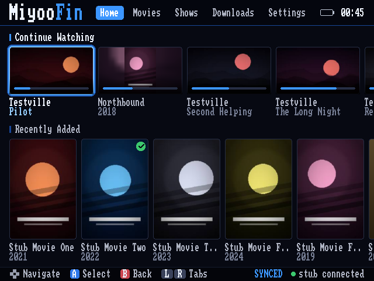 | 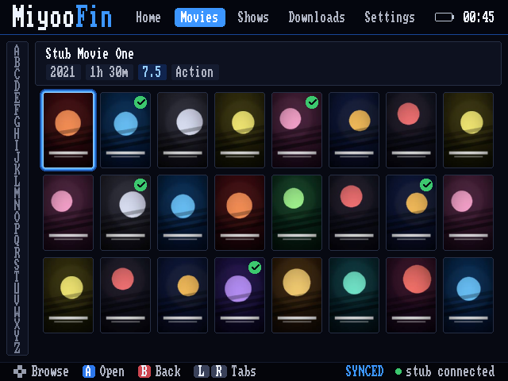 |

| Shows | Seasons |
|---|---|
| 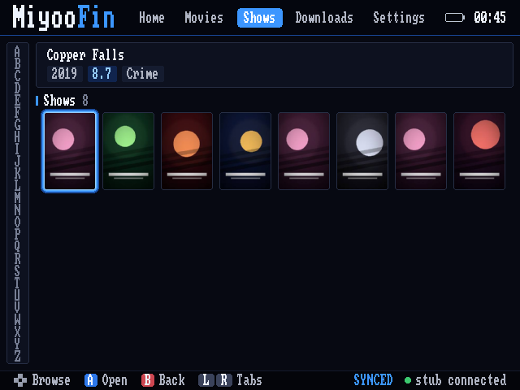 | 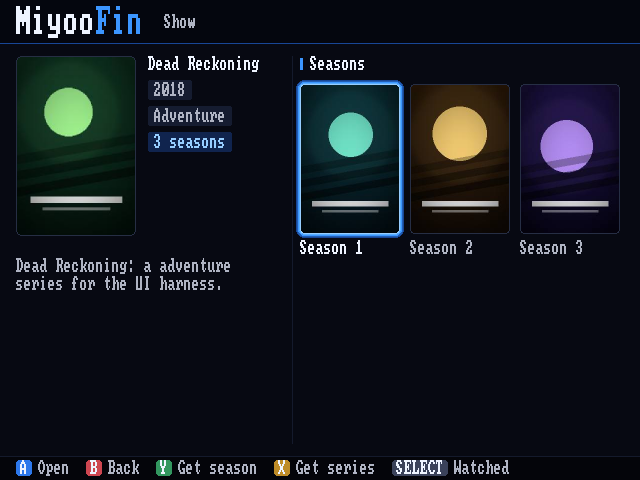 |

| Episodes | Movie page |
|---|---|
| 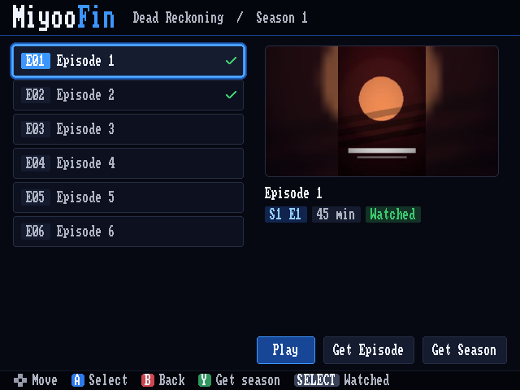 | 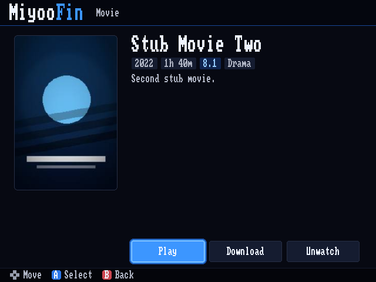 |

| Settings | |
|---|---|
| 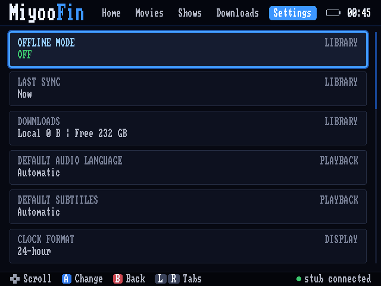 | |

### Music

| Home | Albums (grid) |
|---|---|
| 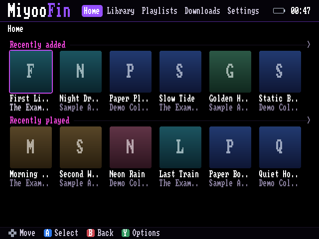 | 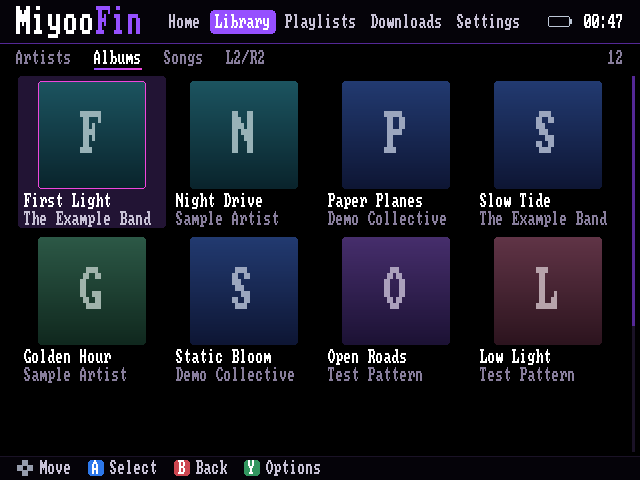 |

| Album page | Now Playing |
|---|---|
| 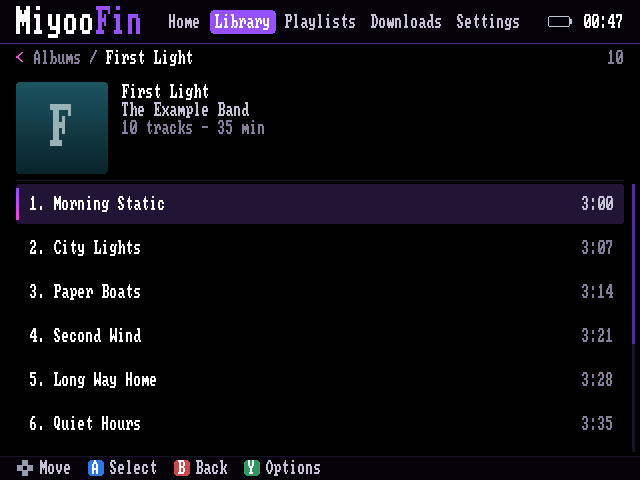 | 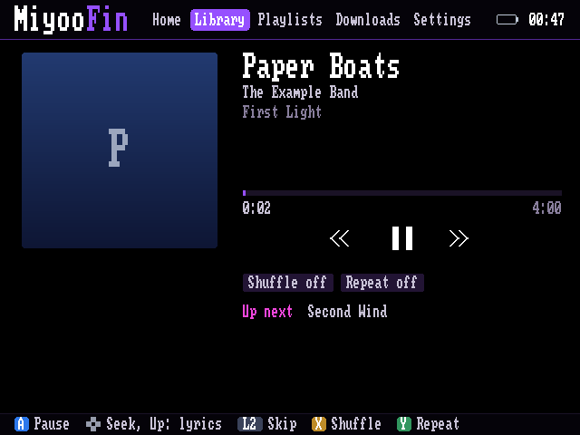 |

| Lyrics | Queue |
|---|---|
| 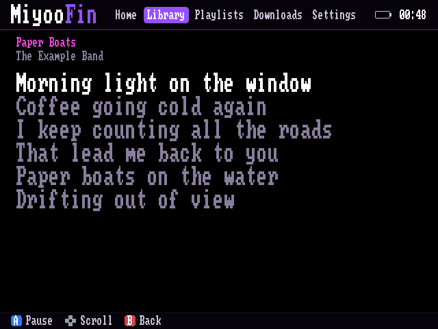 | 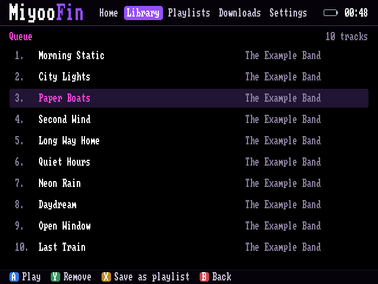 |

| Playlists | Settings |
|---|---|
| 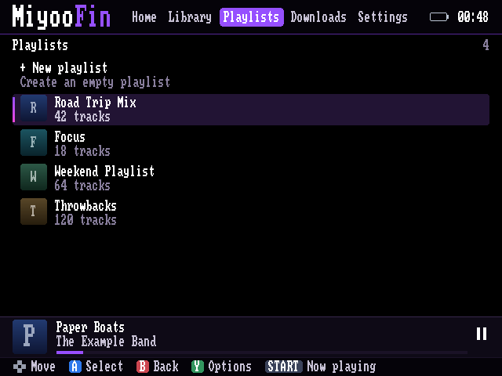 | 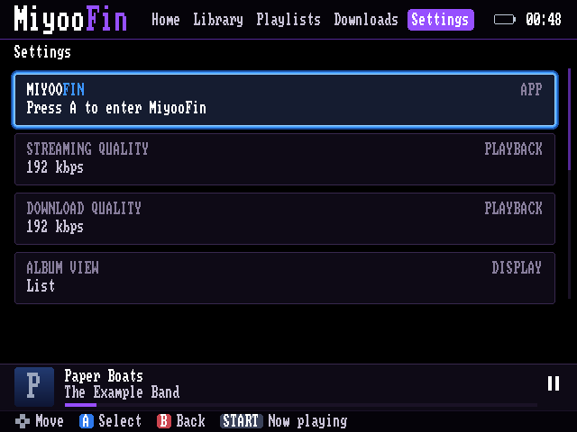 |

See the [user guide](docs/user-guide.md) for the buttons and settings.

<sub>To regenerate: `sh tools/ui-script/run.sh tour` and `tour-detail` (video), `make shots-music` (music).</sub>

## Known limitations

Stated up front rather than discovered later:

- **No text search** — you move through the library with the alphabet rail
  (video) or the A-Z filter (music).
- **No quality picker for video** — downloads use one fixed profile tuned for the
  device's 640x480 screen (music has 128 / 192 / 320 kbps).
- **Skip intro needs server support** — Jellyfin 10.10 or later with intro
  detection (the Intro Skipper plugin or built-in segments).
- **No collections, instant mix or sleep timer** yet. (Favorites, playlists and lyrics are in Music; video has no favorites yet.)

## Installation

**Requires:** Miyoo Mini Plus running [OnionOS](https://github.com/OnionUI/Onion).

1. Download the latest `MiyooFin.zip` release.
2. Extract it and copy the `MiyooFin/` folder to the SD card at:
   ```
   SDCARD/App/MiyooFin/
   ```
3. On your Miyoo, launch **Apps → MiyooFin** from the OnionOS menu.

No manual shared-library setup is required for a normal installation;
the prebuilt package is designed to run within the OnionOS environment.

> **Updating from a beta:** `v0.1.0-beta.x` builds have no updater. Download the
> current `MiyooFin.zip` and copy the folder over your existing installation —
> settings and downloads are preserved. From 0.2.0 onward, **Settings → UPDATES**
> installs new versions in place.

## Status

Active development — browsing, playback, downloads, offline mode and OTA updates
are functional and verified on hardware. See
[Known limitations](#known-limitations) for what is not there yet.

## Building

### Prerequisites

- Docker (required for cross-compilation)
- GNU Make
- A Miyoo Mini Plus running OnionOS and reachable over SSH
  (needed once for the first-time library import step below)

### First-time setup

Enable SSH on the Miyoo, then fetch six external build-time libraries:

```shell
make import-miyoo-libs
```

The script prompts for the Miyoo IP address or hostname and SSH username.
OnionOS uses `onion` by default when SSH authentication is enabled; use
`root` when SSH authentication is disabled.

For non-interactive use, provide a full SSH target:

```shell
MIYOO_HOST=onion@192.168.1.50 make import-miyoo-libs
```

### Host (development)

```shell
make
```

Runs on the build machine. Produces `output/build/miyoofin`.

### OnionOS (cross-compilation via Docker)

```shell
make onionos
```

### OnionOS package

```shell
make package
```

Stages the ready-to-copy OnionOS App folder under `output/package/`.

For a public binary release, use `sh tools/build-release.sh` instead. That
wrapper adds the project license and third-party notices before creating the
redistributable ZIP. See [RELEASING.md](RELEASING.md).

### Quality loop

The normal host-side quality loop is:

```shell
make format-check
make -j2
make test -j2
make refactor-check
git diff --check
```

Production C/C++ and first-party C/C++ tools are checked with the repository's
`.clang-format` configuration. The host and ARM Makefiles compile first-party
C++ with `-Wall -Wextra -Wpedantic`; vendored `stb_image` is the only narrow
translation-unit warning exception. CI runs the authoritative clang-format
check. An optional host-only `make clang-tidy` target is documented in
[docs/code-quality.md](docs/code-quality.md).

### Verify ARM binary

```shell
make verify-arm
```

### Clean

```shell
make clean
```

For build-system details, see [docs/toolchain.md](docs/toolchain.md).

## Hardware

- **Device:** Miyoo Mini Plus
- **SoC:** SigmaStar SSD202D
- **CPU:** Dual-core ARM Cortex-A7 @ ~1.2 GHz
- **RAM:** 128 MB
- **Display:** 640x480
- **ABI:** ARMv7 hard-float (`arm-linux-gnueabihf`)
- **OS:** OnionOS (UI overhaul within the Miyoo firmware environment)

## License

GPL-3.0-only — see [LICENSE](LICENSE) for the full text.

Bundled-component licenses, notices, and source-availability information are
recorded in [THIRD_PARTY_NOTICES.md](THIRD_PARTY_NOTICES.md).
